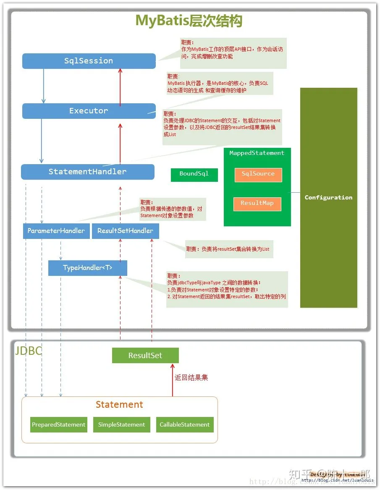

## Spring整合mybatis简单配置
1. pom引入mybatis的starter
2. 配置数据库连接池
3. Springboot配置文件里配置mybatis相关参数
4. 编写自己的dao以及mapper配置文件

配置datasource，比如用druid链接池配置
```
spring:
  datasource:
    #druid相关配置
    type: com.alibaba.druid.pool.DruidDataSource
    driver-class-name: com.mysql.jdbc.Driver
    #配置数据库连接
    druid:
      url: jdbc:mysql://localhost:3306/test-db?useUnicode=true&allowMultiQueries=true&useSSL=false&serverTimezone=Asia/Shanghai
      username: root
      password: 123456
      initial-size: 10
      max-active: 100
      min-idle: 10
      max-wait: 60000
      pool-prepared-statements: true
      max-pool-prepared-statement-per-connection-size: 20
      time-between-eviction-runs-millis: 60000
      min-evictable-idle-time-millis: 300000
      validation-query: SELECT 1 FROM DUAL
      test-while-idle: true
      test-on-borrow: false
      test-on-return: false
      connectionInitSqls: set names utf8mb4
```
配置mybatis参数，指定mapper文件路径
```
mybatis:
  mapper-locations: classpath:mapper/*.xml
```
定义dao接口，并加上@Mapper注解
```java
@Mapper
public interface UserInfoDao {
    
    int insert(UserInfoDO userInfoDO)
    
    UserInfoDO getById(long id);
    
    int update(UserInfoDO userInfoDO);

    int delete(long id);
}
```
配置mapper文件，写好sql与dao接口的映射关系，其中namespace是对应的dao接口完整类名。
```xml
<?xml version="1.0" encoding="UTF-8" ?>
<!DOCTYPE mapper PUBLIC "-//mybatis.org//DTD Mapper 3.0//EN" "http://mybatis.org/dtd/mybatis-3-mapper.dtd" >
<mapper namespace="com.hj.dao.UserInfoDao">
    <resultMap id="BaseResultMap" type="com.hj.DO.UserInfoDO">
        <id column="id" property="id"/>
        <result column="userId" property="userId"/>
        <result column="name" property="name"/>
    </resultMap>
    
    <insert id="insert" parameterType="com.hhdd.DO.UserInfoDO">
      insert ...
    </insert>

    <select id="getById" resultMap="BaseResultMap" parameterType="java.lang.Long">
        select ...
    </select>

    <update id="update" parameterType="com.hj.DO.UserInfoDO">
        update ...
    </update>

    <delete id="delete">
        delete ...
    </delete>

</mapper>
```
想spring容器中注册SqlSessionFactory，并根据mapper配置文件解析出dao与具体jdbc操作、resultMap与实体类的映射关系。

注册实现了CRUD的SqlSessionTemplate类
